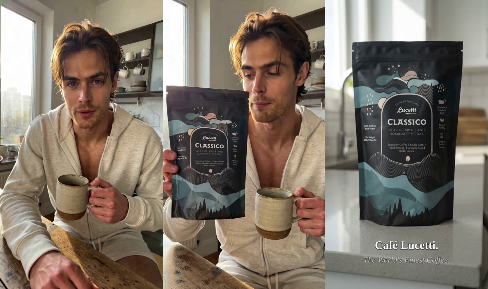
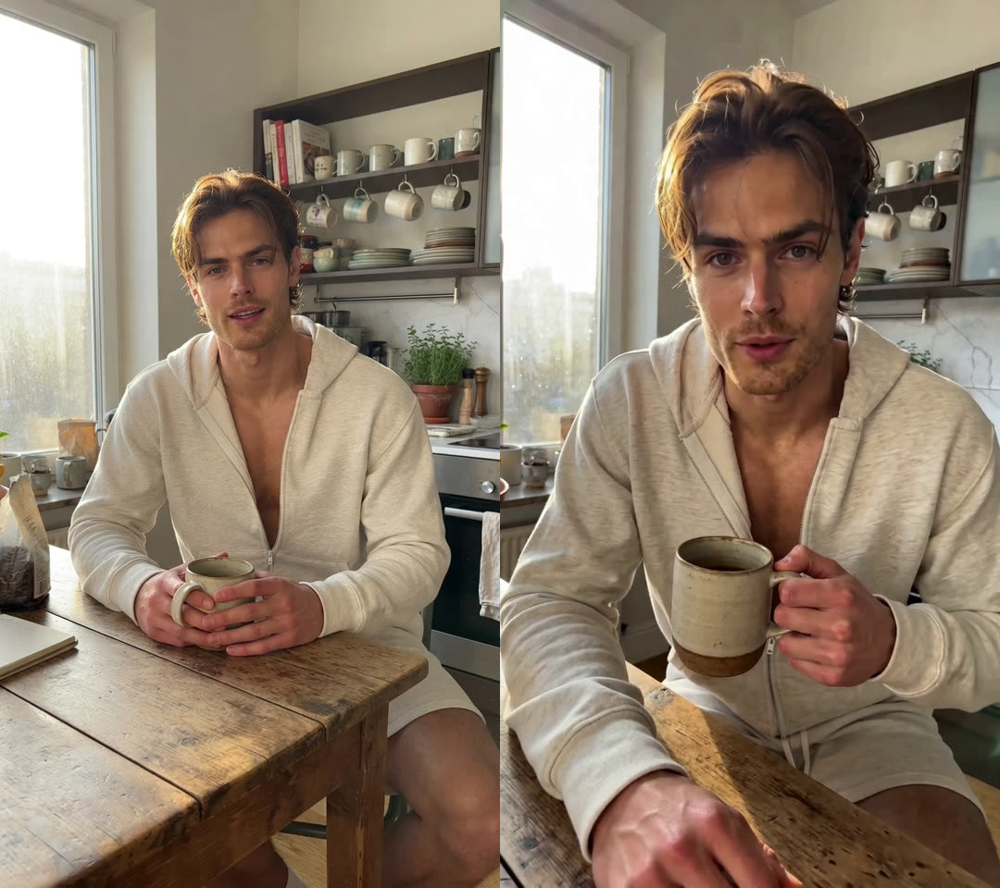
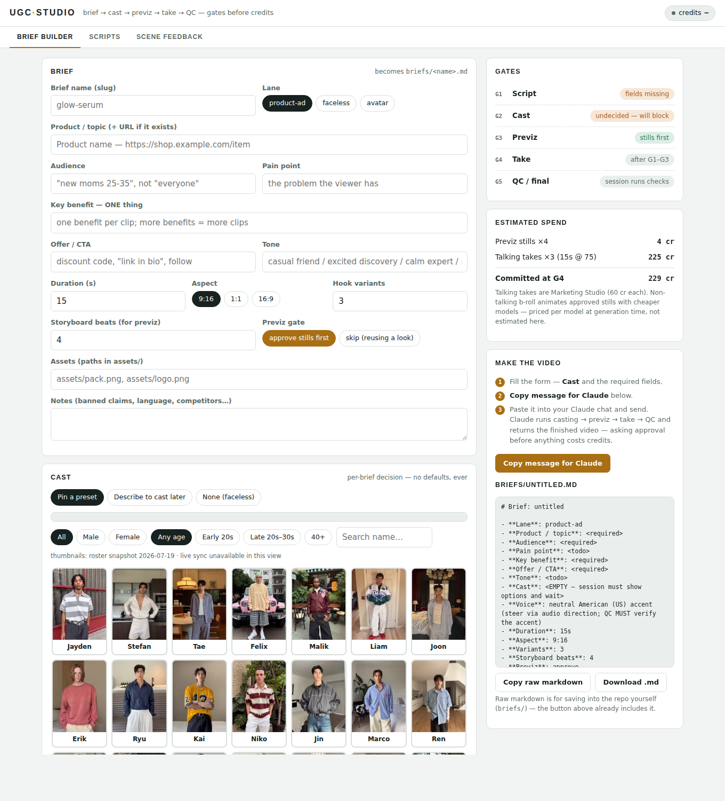
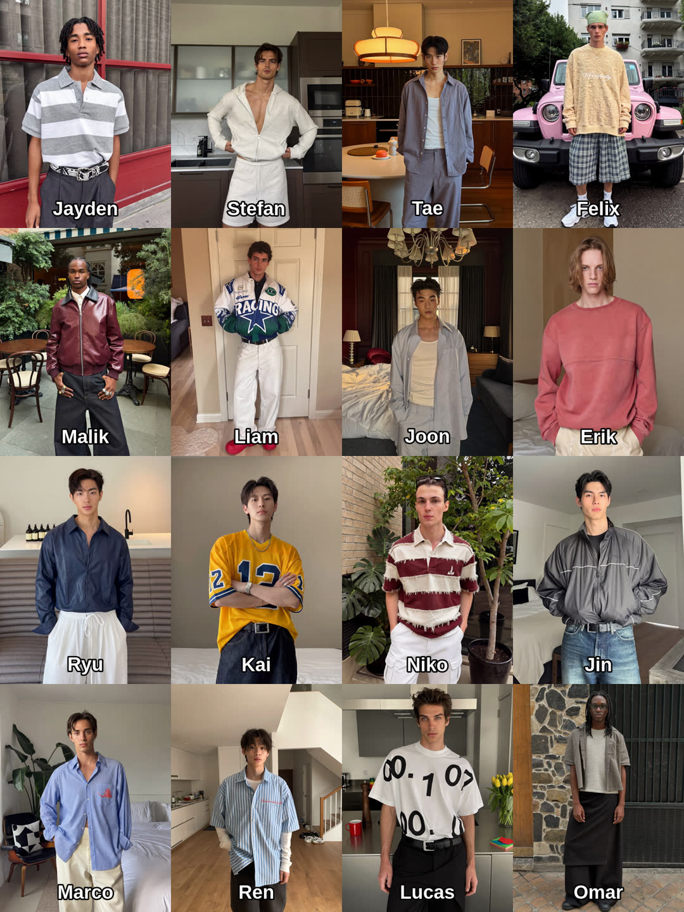
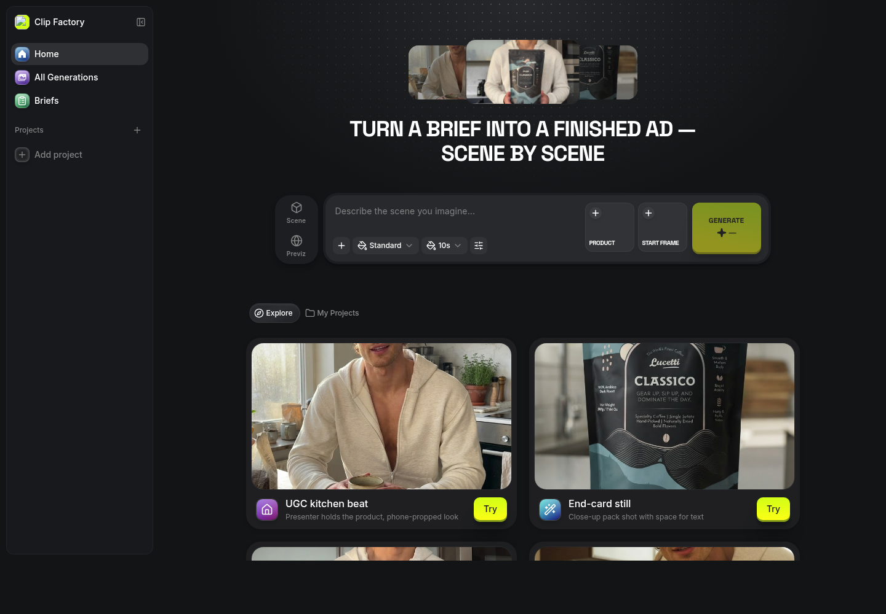
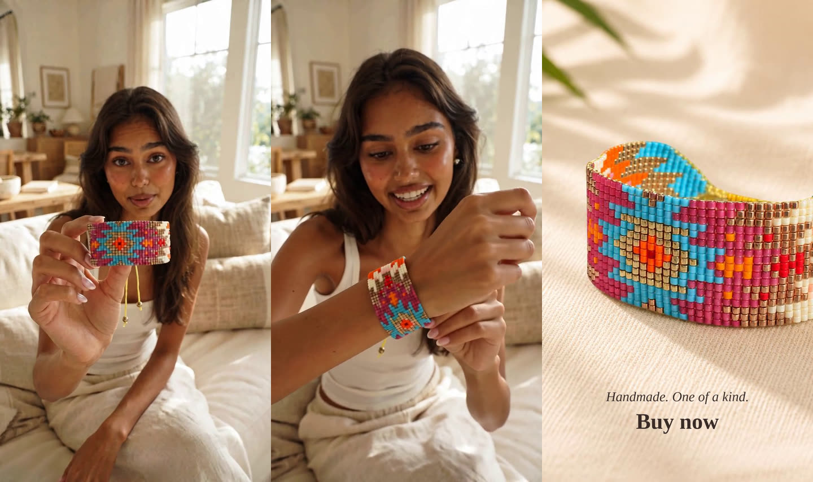

# Video Ad Production Tool

An agent-driven factory for short vertical video ads (UGC style and
longer scene-based pieces), built on **Claude Code** + **Higgsfield**.
You write a brief; the system runs a gated production pipeline — script →
casting → previz → take → QC — and never spends generation credits on
anything you haven't approved.

One brief in, one finished ad out — hook, product reveal, end card:



## Why gates

Video models are stochastic and priced per take (a talking-presenter take
is 60–75 credits). The pipeline's job is to make every surprise happen at
the **cheap** stage:

| Gate | What you approve | Cost to reach it |
|------|------------------|------------------|
| G1 Script | Full script text, beat by beat | 0 credits |
| G2 Cast | Who is on camera (contact sheet, no auto-picks ever) | 0 |
| G2b Voice | Accent/voice (US/UK steer or pinned voice) | 0 |
| G3 Previz | Key-frame stills of cast + product + setting | ~1 credit/beat |
| G4 Take | The video generation itself | 60–75/take (talking) |
| G5 QC | Machine checks + your eyes | 0 (local ffmpeg) |

The approved previz frame is passed as the take's start image, so the
video opens on exactly the look you signed off:



## The three surfaces

**1. This repo — the production pipeline.** Open it in Claude Code with a
Higgsfield connector (or the `higgsfield` CLI + skills). `CLAUDE.md`
routes every brief through `playbooks/production.md` and a lane playbook
(product ads, faceless, avatar, longform). Local ffmpeg does QC
(silence-detection to verify comedic beats actually land, frame
extraction for product fidelity), end cards, and stitching — video
credits are never spent on assembly.

**2. The control panel — a Claude artifact.** `panel/studio.html` is a
single-file page published as a private claude.ai artifact with live MCP
access to your Higgsfield account: brief builder with casting roster and
age/gender filters, voice picker with US/UK accent tagging, full-text
script review, cost meter, and a scene-by-scene feedback funnel. See
`panel/README.md`.



Casting is a first-class user decision — the pipeline builds contact
sheets from Higgsfield's preset avatars (free) and **waits** for a pick;
the backend is never allowed to auto-cast:



**3. Clip Factory — a deployed web app** (Higgsfield Websites `app`
type, running on Cloudflare Workers with sign-in-with-Higgsfield).
Scene/Previz modes, a quality-tier pill mapped to the measured price
ladder, product + start-frame reference slots for scene continuity,
briefs and feedback stored in D1:



The app source is built from Higgsfield's proprietary starter template
and runs only on their platform, so it isn't vendored here — rebuild it
in ~an hour by opening this repo in Claude Code and asking for the app
described in `playbooks/longform.md` ("Clip Factory app" section).

## What the output looks like

Hook, product-on-wrist reveal, end card — the end card is built locally
from the product photo (free, ffmpeg zoom + text) instead of burning a
second video take:



## Video models: cost and strengths

Measured with free `get_cost` preflights at a standard ~10s, 720p, 9:16
scene (July 2026 — prices move; the pipeline re-preflights before every
spend). Full catalog with specialists and post tools:
**[docs/video-models.md](docs/video-models.md)**.

| Model | Credits | Best at |
|---|---|---|
| `marketing_studio_video` | 60 (12s) / 75 (15s max) | The only speech + lipsync + product-lock package — all talking-presenter work |
| `cinematic_studio_3_0` | 50 | Cinema-grade look, genre control (audio off by default) |
| `seedance_2_0` std / fast | 45 / 35 | Reference-driven continuity: consistent identity across scenes, start/end frames, up to 4K |
| `seedance_2_0_mini` | 25 | Same reference system at half the price (720p max) |
| `veo3_1` (8s) | 22 | Ultra-realistic cinematic (4/6/8s only) |
| `kling3_0` | 20 | Multi-shot, audio sync, motion transfer |
| `kling3_0_turbo` | 15 | Fast start-frame animation (no audio) |
| `seedance1_5` | 14.39 / **12s** | Cheapest per second on the ladder |
| `veo3_1_lite` (8s) | 12 | Budget batch b-roll |
| `minimax_hailuo` (10s) | 11 | Physics + facial emotion (no audio at 768p) |

### Credit pricing (Higgsfield plans, July 20, 2026)

| Plan | Monthly credits | Price | Effective cost |
|---|---|---|---|
| Basic | 120 | $9/month | $0.075 per credit |
| Plus | 1,000 | $49/month | $0.049 per credit |
| Ultra | 3,000 | $129/month | $0.043 per credit |

In dollars on the Plus plan, that makes a talking-presenter take about
**$2.95–3.70**, a complete 14-second ad (previz + take + local end card)
about **$3.10**, and a 2-minute scene-pipeline piece roughly **$7–15**
depending on tier mix. Plan pricing changes — check higgsfield.ai.

Rules that survived real production: talking → Marketing Studio, nothing
else lipsyncs its own speech · scene continuity → Seedance 2.0 references
· longer than 15s is always a scene pipeline (`playbooks/longform.md`) —
a 2-minute piece lands around 150–300 credits on a mixed tier ·
generate at 720p, upscale only the winning cut.

## Platform gotchas

- **Casting**: Higgsfield auto-picks an avatar if you don't pin one.
  The pipeline forbids submitting presenter video without an avatar ID.
- **Ages**: all ~40 preset avatars read 18–35. Older presenters are
  minted as custom avatars from an approved 1-credit character reference.
- **Voice**: Marketing Studio has no voice parameter — steer the accent
  in the prompt's audio direction AND verify at QC, or pin a preset voice
  and apply it as a `voice_change` revoice pass on the finished take.
- **Duration**: every generation model caps at ~15s. Length comes from
  scenes + stitching, not longer takes.
- **Chat attachments**: files pasted into Claude chat can't reach
  Higgsfield tools — use the `media_upload_widget` MCP flow.

## Getting started

**Authentication first — note there is no API key.** Higgsfield doesn't
issue keys; everything is OAuth against your own account, and your
generation credits are billed there. Two ways in:

- **Connector (recommended):** on [claude.ai](https://claude.ai), add the
  Higgsfield connector under Settings → Connectors and sign in. Claude
  Code sessions then reach your account through it — nothing to paste,
  nothing stored in the repo.
- **CLI:** `npm i -g @higgsfield/cli`, then `higgsfield auth login`
  (opens a browser), then `npx skills add higgsfield-ai/skills`. Works
  on a local machine; headless/remote containers can't complete the
  browser flow — use the connector there.

Because auth is OAuth, this repo never contains credentials — nothing to
scrub before forking or sharing your copy.

Then:

1. Clone and open the repo in [Claude Code](https://claude.com/claude-code).
2. `apt-get install -y ffmpeg` if missing.
3. Copy `briefs/TEMPLATE.md` to `briefs/<your-product>.md`, fill it in —
   Cast and Voice are required for spoken video.
4. Tell Claude: *"Produce the brief in `briefs/<your-product>.md` per
   `playbooks/production.md`."* It will show scripts, wait for casting,
   show previz, confirm cost, and deliver a QC'd stitched ad into
   `output/<brief>/`.
5. After watching, file scene-by-scene feedback
   (`briefs/FEEDBACK-TEMPLATE.md`) — flagged scenes get regenerated,
   winning ingredients go to `assets/higgsfield-ids.md` and compound.

## Repo map

```
CLAUDE.md                 agent instructions (pipeline routing + rules)
playbooks/production.md   the five gates, price ladder, QC, feedback loop
playbooks/product-ads.md  UGC ad lane (hooks, prompt patterns)
playbooks/longform.md     scene pipeline for 30s–3min pieces
playbooks/faceless.md     narrated/faceless lane
playbooks/avatar.md       Soul character (your own face) lane
briefs/TEMPLATE.md        the brief format — the control panel of every ad
briefs/FEEDBACK-TEMPLATE.md  scene-by-scene review format
tools/                    ffmpeg post-production (stitch, captions, crop)
panel/                    the Claude-artifact control panel (see its README)
assets/higgsfield-ids.md  your account's reusable IDs (starts empty)
docs/video-models.md      measured model costs + strengths
```

## License

**PolyForm Shield 1.0.0** — free to use for any purpose, including
commercially producing your own ads with it. The one thing you may not
do is offer the software itself (or a derivative) as a competing
product or service. See [LICENSE](LICENSE).
